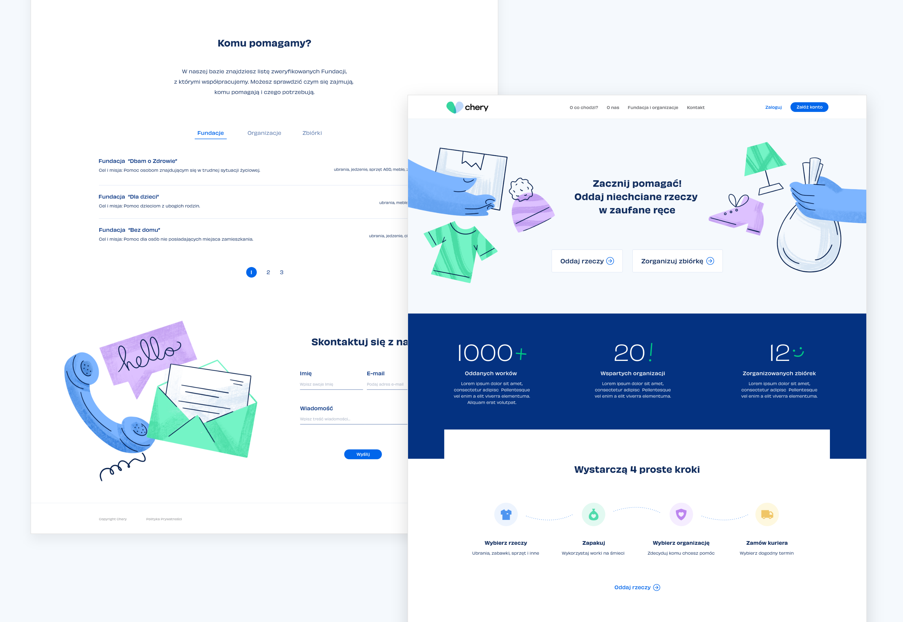

# Chery

It's a project of a website that helps you donate redundant things for charity organizations. You can log in or register as a new user through firebase. You can also send a message using the contact form. In the near future, I want to add a subpage where you will fill the form to donate your stuff for dedicated charity.

App was created with `create-react-app`

## Take a look at my page [here](https://jdzianok.github.io/chery/)

## Preview

## The website offers basic functionalities

- RWD - mobile first
- displaying list of charity organizations (including pagination)
- sign in and sign up (firebase)
- contact form with validation where you can send your message to Coderslab server (fetch)

## Available Scripts

In the project directory, you can run:

### `npm start`

Runs the app in the development mode. 
Open [http://localhost:3000](http://localhost:3000) to view it in the browser.

The page will reload if you make edits. 
You will also see any lint errors in the console.

### `npm test`

Launches the test runner in the interactive watch mode. 
See the section about [running tests](https://facebook.github.io/create-react-app/docs/running-tests) for more information.

### `npm run build`

Builds the app for production to the `build` folder. 
It correctly bundles React in production mode and optimizes the build for the best performance.
